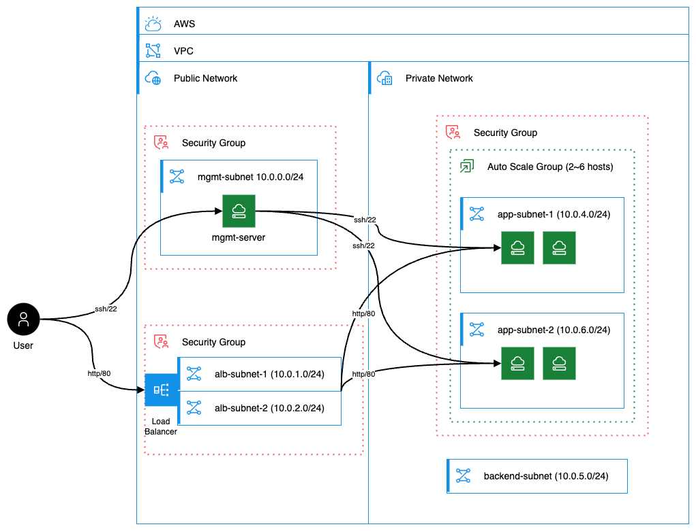
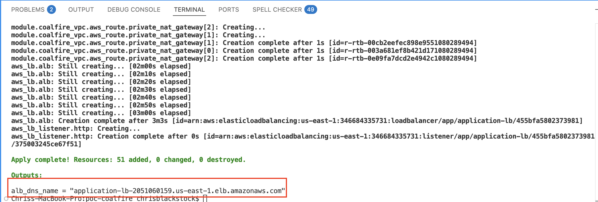
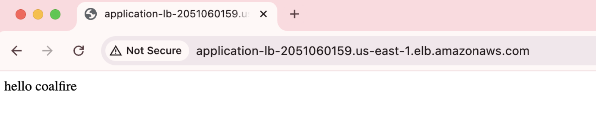
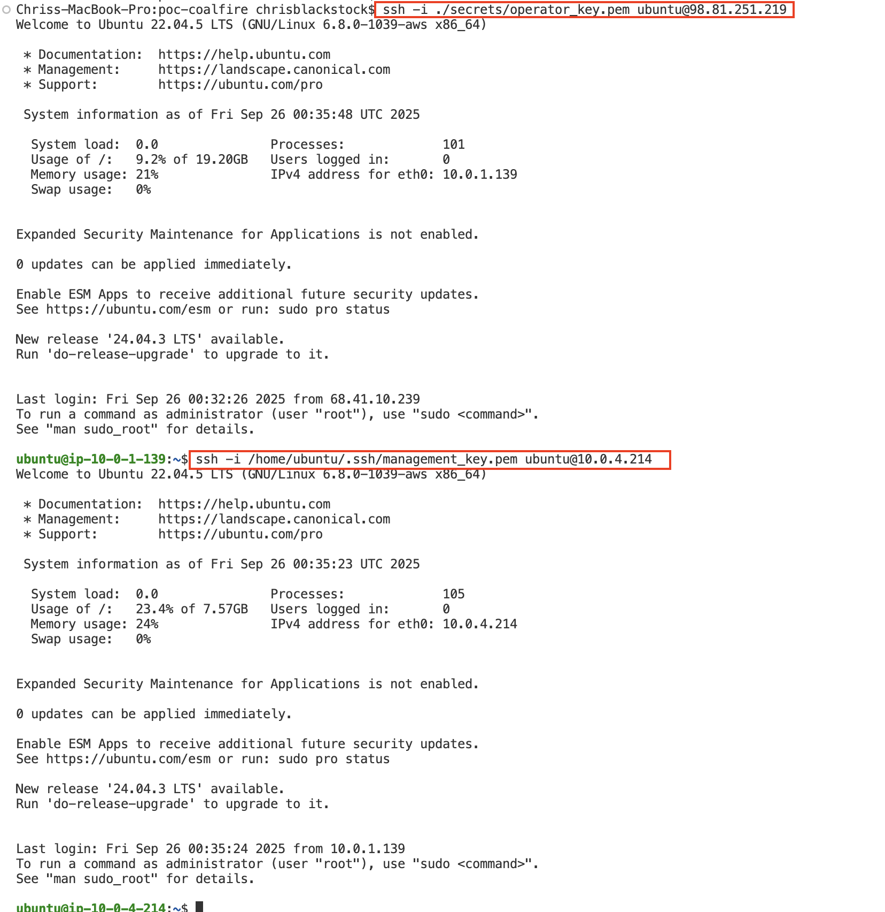
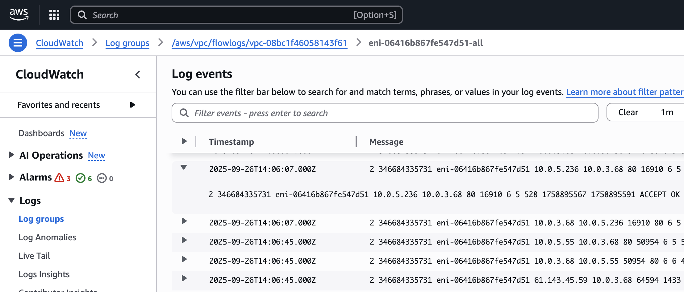

# Solution Overview

This repository contains a PoC web server environment that is fully deployable to AWS by terraform.   The environment is configured such that:

- An application load balancer accepts HTTP traffic and forwards it to the application servers
- The application servers are managed by an auto scaling group
- A managment server exists in the public subnet and is able to ssh to the application servers
- Security groups exist that permit:
  - a single host/network space to ssh to the management server
  - The alb can only be accessed on port 80, and the application servers can only be reached by the alb on port 80 and the management server on port 22.  
  - The application servers are not directly accessible from the internet

# Deployment Instructions

1. Clone this repository
    - `git clone git@github.com:MD4HASH/poc-coalfire.git`
2. Install [terraform](https://developer.hashicorp.com/terraform/tutorials/aws-get-started/install-cli) and the [AWS CLI](https://docs.aws.amazon.com/cli/latest/userguide/getting-started-install.html)
3. Authenticate to AWS by defining the `AWS_ACCESS_KEY_ID` and `AWS_SECRET_ACCESS_KEY` environment variables.
    - `export AWS_ACCESS_KEY_ID=`
    - `export AWS_SECRET_ACCESS_KEY=`
4. Initialize terraform
    - `terraform init`
5. Run terraform plan and apply
    - `terraform plan`, `terraform apply`

# Operational Instructions

- This role generates two TLS pairs and stores the private key of both in the `secrets/` directory.  One is for access to the mangement server, and the other for the mangement server to access the application servers.  **Ensure that this directory is in your .gitignore file**, as it is in this repository.
- When terraform completes, it will output the variable `alb_dns_name.` Enter this in a web browser.  Ensure that the url starts with `http://` and is not automatically changed to `https://` by the browser. (See "Recommended Improvements" section of this readme).  It will also output the public IP of the management server.

- In `variables.tf` there is a variable called `source_ip`.  Set this to the public IP/CIDR of the host you will be using to ssh to the management server.
- from the root terraform directory, you can use `operator_key.pem` to ssh to the management server's public ip:
  - `ssh -i ./secrets/operator_key.pem ubuntu@x.x.x.x`
- from the management server, you can also ssh to the application servers
  - `ssh -i /home/ubuntu/.ssh/management_key.pem ubuntu@x.x.x.x`

# Implemented Improvements

- This projects generates unique TLS keys for operator access to the management server, and for management server access to the application servers.  It stores them in the local filesystem (excluded from git) and adjusts permissions as required.
- This projects adds three subnets to the proposed design in order to implement regional availability: two dedicated subnets for the ALB, and one extra subnet to pair with the origional application subnet.
- This projects adds VPC flow logs for network visibility.

# Recommended Improvements

The following reccomendations are given in order of priority:

- Obtain a signed certificate for the load balancer, redirect all incoming web connections to HTTPS (443)
- Add logging throughout.  Cloudwatch agents on the EC2 instances, ALB Access logs, Cloud Trail logs for user API calls
- Front the ALB with AWS WAF
- Implement AWS Systems Manager on the EC2 instances, and scan for vulnerabilities and benchmark compliance with AWS Inspector
- Use a CIS-hardened AMI for the EC2 instances
- Define the ALB with a module instead of raw resources
- The management ssh key, used by the management server to access the application servers, should be stored in and retrieved from AWS Secrets Manager or the System Parameter Store
- Store terraform state in S3
- The null resource and associated provisioners are not durable.  Could probably be improved with the user_data feild.
- The egress policies for all SGs are wide open.  They should filter at least by port.
- Improve tagging
- The "backend subnet" is empty, and should be removed
